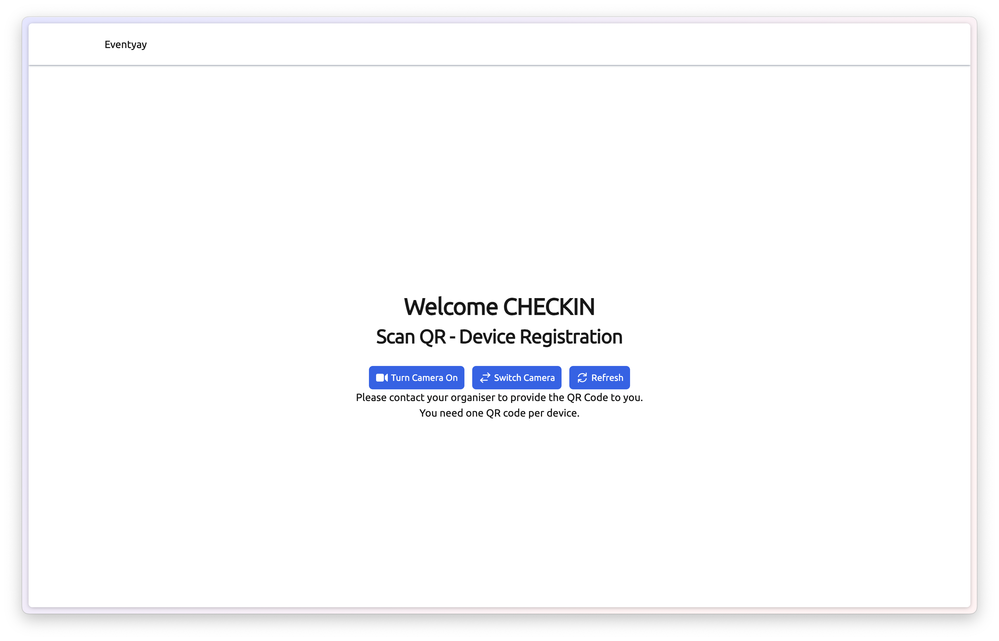
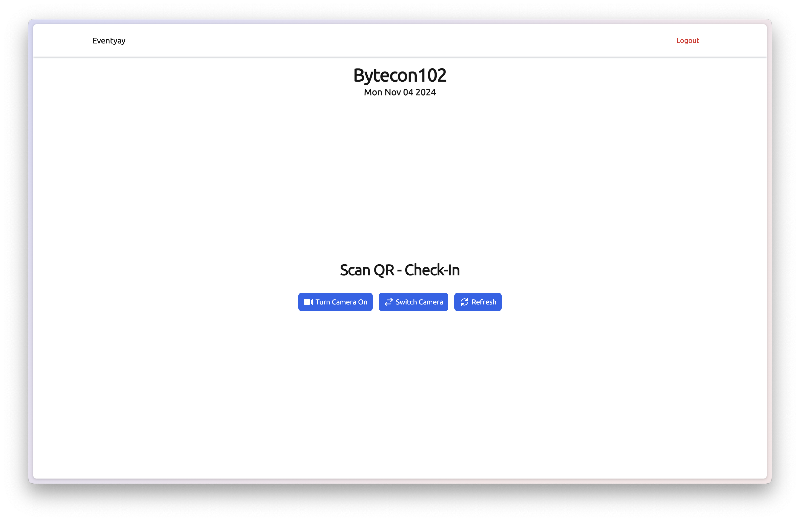
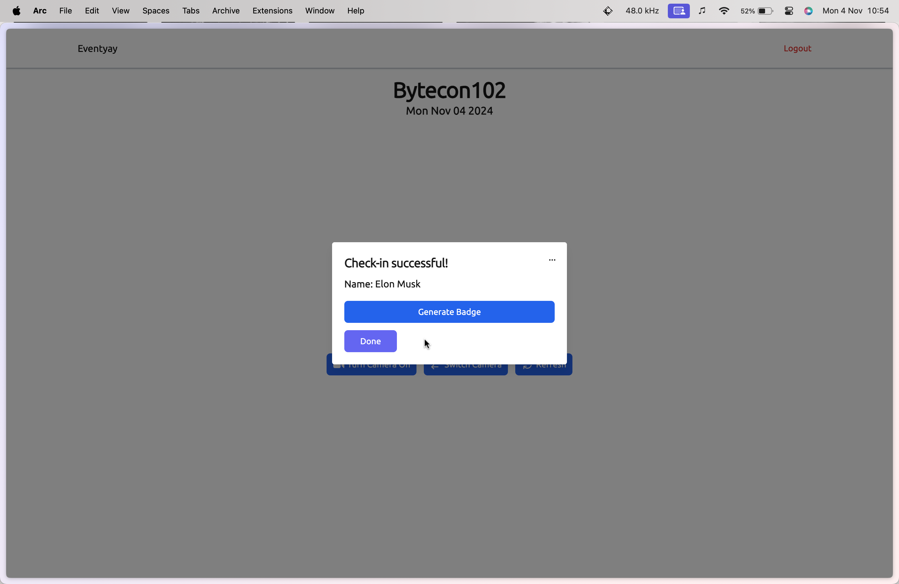
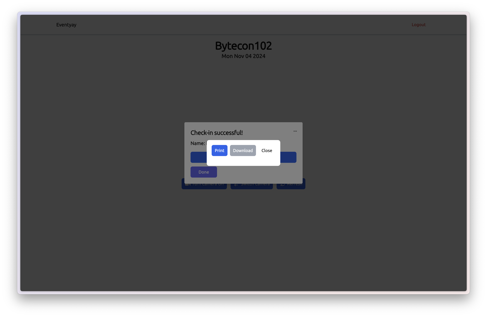
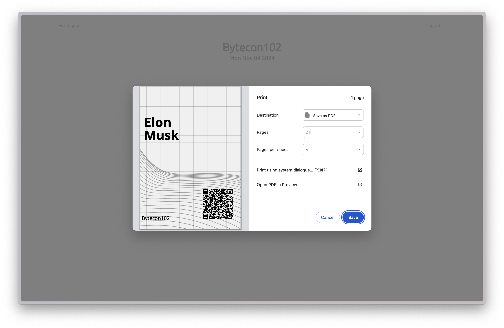

# Checkin workflow

**Step 1:** Choose a station type on the login page (`Check-In Staff`, `Badge Station`, or `Lead Scanner`).

**Step 2:** Register the device by scanning the organizer QR code from **Connected devices**, or choose **Or enter URL and Token manually** and enter your server URL and setup token.

**Step 3:** Select the event and, for check-in staff or badge stations, the check-in list.

**Step 4:** Scan attendee tickets with the camera.

**Step 5:** After a successful checkin, a popup shows attendee name and ticket details. Organizers can configure extra fields per check-in list in the Eventyay control panel.

Use **Print badge** or **Print preview** when badges are enabled.

**Step 6:** If badge customization is enabled for the layout, choose which fields to include before printing.

**Step 7:** Confirm the browser print dialog when printing manually.

