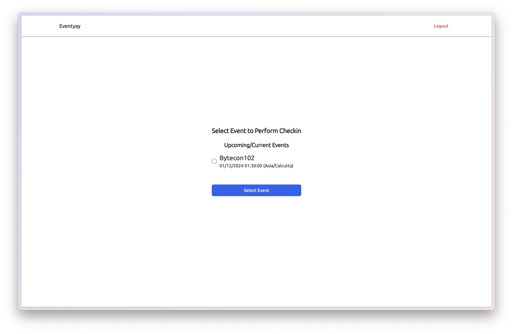
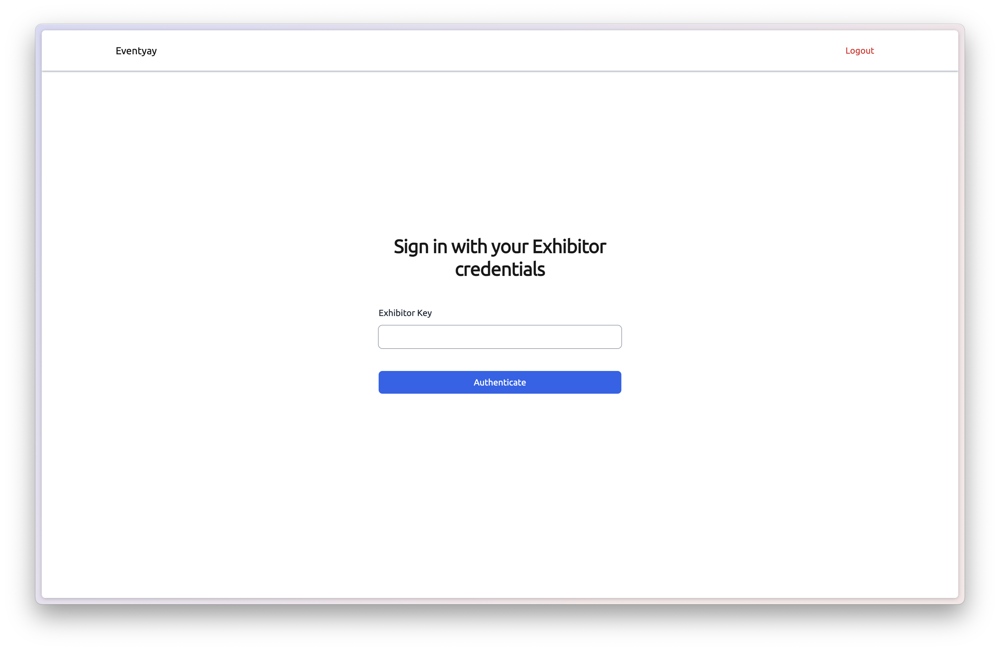
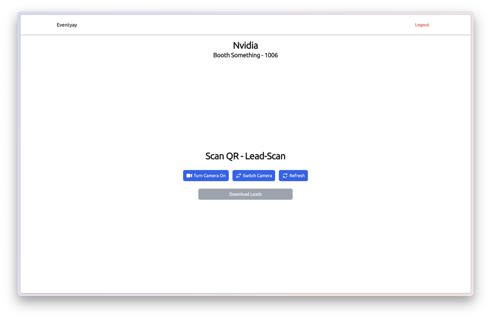

# Exhibitor workflow

**Step 1:** Choose **Lead Scanner** on the login page.

**Step 2:** Register the device with the organizer QR code or manual URL/token entry (same flow as checkin).

**Step 3:** On **Exhibitor Events**, switch between **Current / Upcoming** and **Past** tabs, then select your event.

**Step 4:** Complete exhibitor login for your booth.

**Step 5:** Scan attendee badges at your booth.

